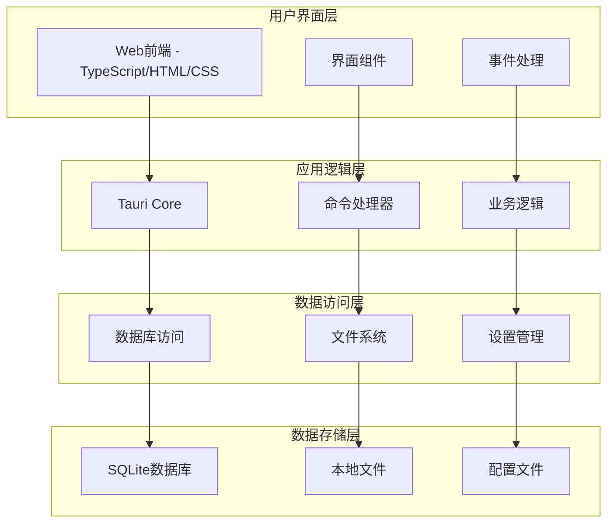
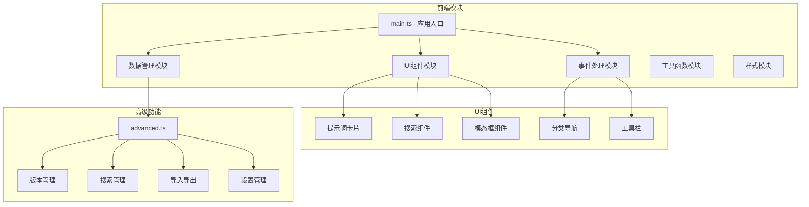
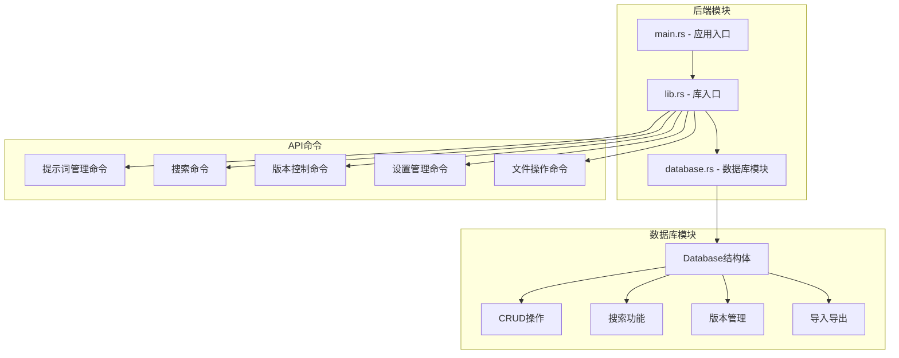
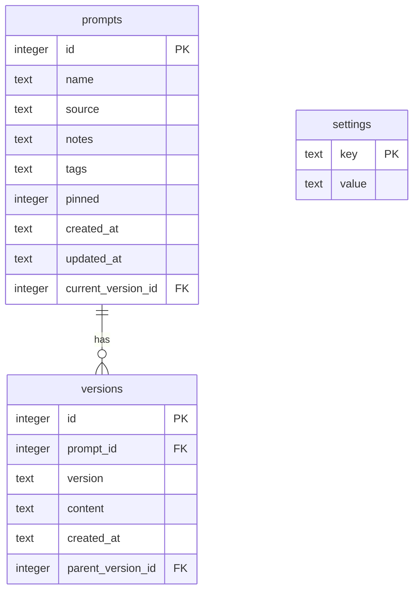
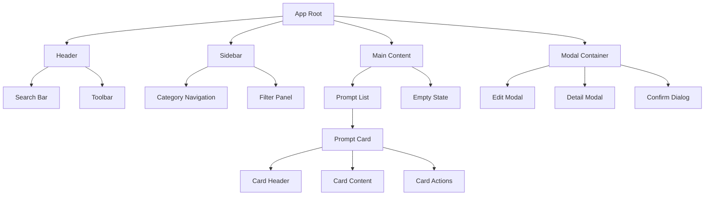
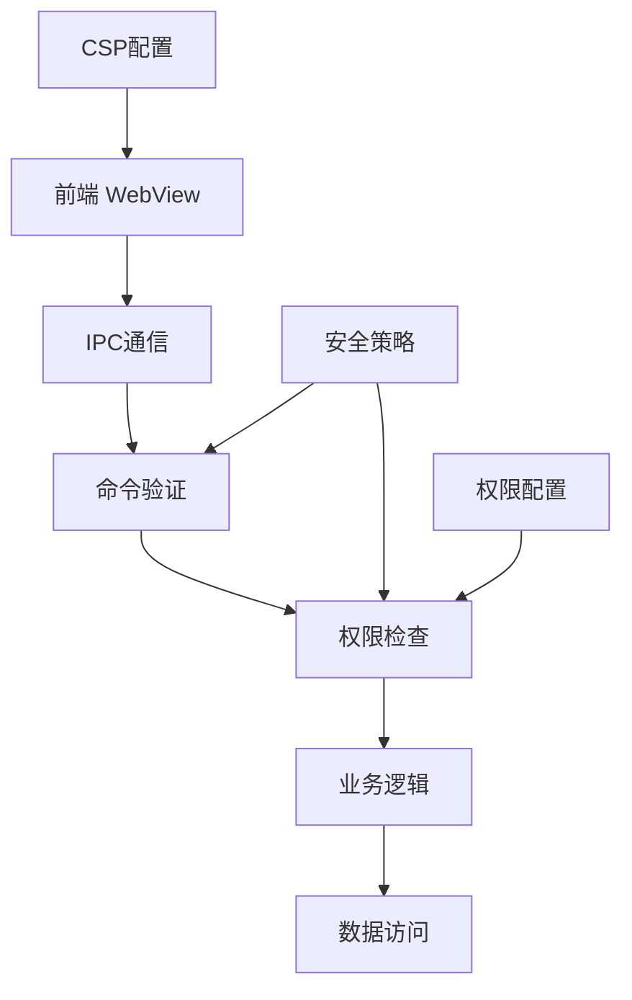
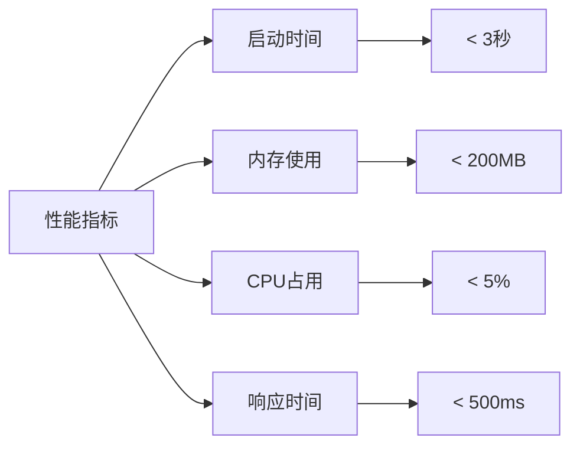
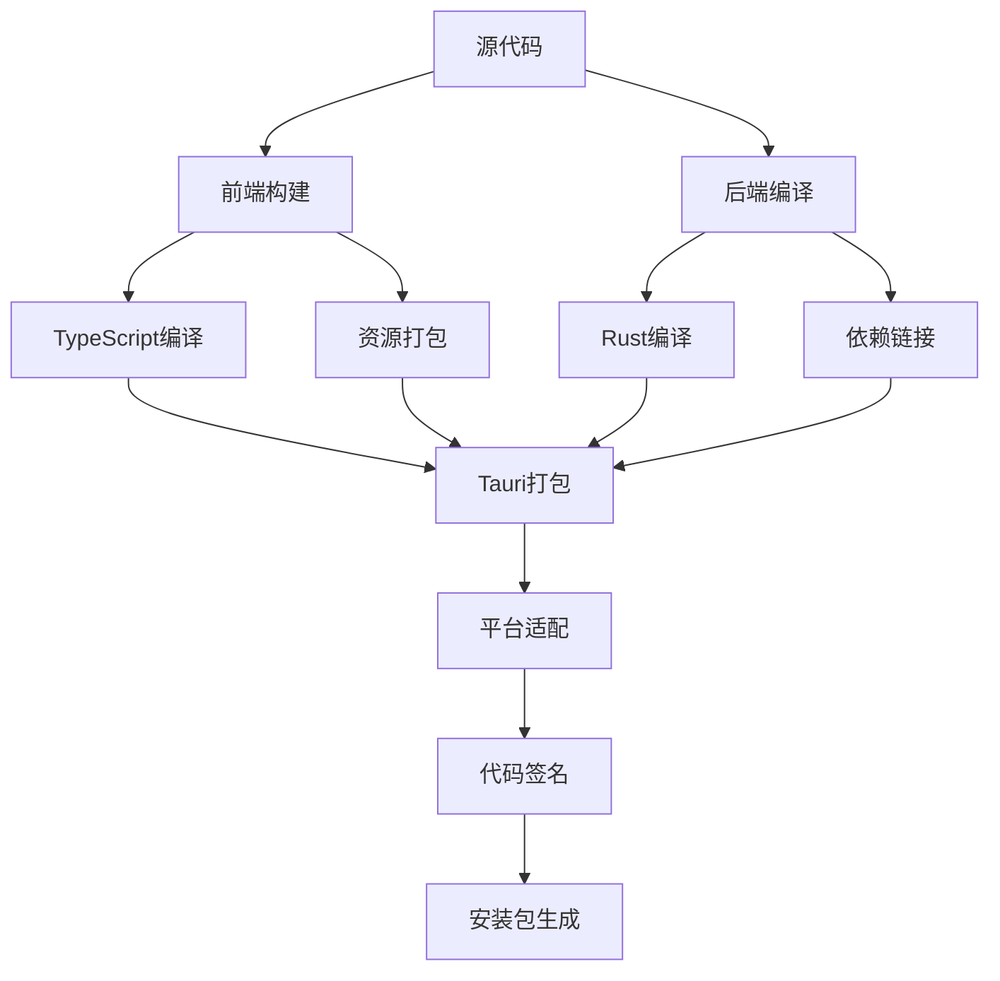
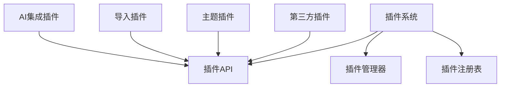

# Prompt Tools 系统架构设计文档

## 1. 架构概述

### 1.1 总体架构
Prompt Tools采用基于Tauri框架的桌面应用架构，结合了Web前端技术的灵活性和Rust后端的性能优势。整体架构遵循分层设计原则，实现了前后端分离、数据持久化和跨平台兼容。



### 1.2 技术栈选择

#### 前端技术栈
- **TypeScript**: 提供类型安全和更好的开发体验
- **Vite**: 快速的构建工具和开发服务器
- **原生DOM**: 轻量级操作，无额外框架依赖
- **CSS3**: 现代化样式和动画效果

#### 后端技术栈
- **Rust**: 高性能、内存安全的系统编程语言
- **Tauri**: 跨平台桌面应用框架
- **SQLite**: 轻量级嵌入式数据库
- **Serde**: JSON序列化/反序列化库

#### 开发工具
- **pnpm**: 高效的包管理器
- **Cargo**: Rust包管理和构建工具
- **Git**: 版本控制系统

### 1.3 架构优势
1. **高性能**: Rust后端提供接近原生的执行性能
2. **轻量级**: Tauri框架生成的应用体积小，资源占用低
3. **安全性**: Rust的内存安全特性和Tauri的安全模型
4. **跨平台**: 一套代码支持多个操作系统
5. **Web技术**: 利用成熟的Web技术栈快速开发UI

## 2. 系统模块设计

### 2.1 前端模块架构



#### 2.1.1 核心模块说明

**main.ts - 应用主模块**
- 应用初始化和启动逻辑
- 事件绑定和生命周期管理
- 全局状态管理
- 键盘快捷键处理

**UI组件模块**
- 提示词卡片渲染
- 搜索和筛选界面
- 模态框和对话框
- 分类导航和工具栏

**数据管理模块**
- 与后端API的通信
- 本地状态缓存
- 数据格式转换
- 错误处理和重试机制

**advanced.ts - 高级功能模块**
- 版本管理功能
- 高级搜索功能
- 数据导入导出
- 系统设置管理

### 2.2 后端模块架构



#### 2.2.1 核心模块说明

**database.rs - 数据库核心模块**
- SQLite数据库连接和管理
- 数据模型定义和操作
- 事务处理和错误恢复
- 数据完整性检查

**lib.rs - API命令处理**
- Tauri命令注册和路由
- 前后端数据传输
- 错误处理和响应格式化
- 权限检查和安全控制

## 3. 数据库设计

### 3.1 数据库架构



### 3.2 表结构详细设计

#### 3.2.1 prompts 表 - 提示词主表
| 字段名 | 类型 | 约束 | 说明 |
|--------|------|------|------|
| id | INTEGER | PRIMARY KEY AUTOINCREMENT | 主键ID |
| name | TEXT | NOT NULL | 提示词名称 |
| source | TEXT | NULL | 来源信息 |
| notes | TEXT | NULL | 备注信息 |
| tags | TEXT | NULL | 标签（JSON格式） |
| pinned | INTEGER | DEFAULT 0 | 是否置顶 |
| created_at | TEXT | NOT NULL | 创建时间 |
| updated_at | TEXT | NOT NULL | 更新时间 |
| current_version_id | INTEGER | FK | 当前版本ID |

#### 3.2.2 versions 表 - 版本历史表
| 字段名 | 类型 | 约束 | 说明 |
|--------|------|------|------|
| id | INTEGER | PRIMARY KEY AUTOINCREMENT | 版本ID |
| prompt_id | INTEGER | FK NOT NULL | 关联的提示词ID |
| version | TEXT | NOT NULL | 版本号 |
| content | TEXT | NOT NULL | 版本内容 |
| created_at | TEXT | NOT NULL | 创建时间 |
| parent_version_id | INTEGER | FK NULL | 父版本ID |

#### 3.2.3 settings 表 - 系统设置表
| 字段名 | 类型 | 约束 | 说明 |
|--------|------|------|------|
| key | TEXT | PRIMARY KEY | 设置键 |
| value | TEXT | NOT NULL | 设置值 |

### 3.3 索引设计
```sql
-- 提示词更新时间索引（用于排序）
CREATE INDEX idx_prompts_updated_at ON prompts(updated_at);

-- 版本关联索引（用于查询特定提示词的版本）
CREATE INDEX idx_versions_prompt_id ON versions(prompt_id);

-- 外键约束
PRAGMA foreign_keys = ON;
```

### 3.4 数据完整性约束
1. **外键约束**: 确保版本与提示词的关联关系
2. **级联删除**: 删除提示词时自动删除相关版本
3. **非空约束**: 核心字段不允许为空
4. **默认值**: 为可选字段提供合理默认值

## 4. 组件设计

### 4.1 前端组件层次结构



### 4.2 核心组件设计

#### 4.2.1 PromptCard 组件
**职责**: 展示单个提示词的信息和操作
**属性**:
- `prompt`: 提示词数据对象
- `onEdit`: 编辑回调函数
- `onDelete`: 删除回调函数
- `onCopy`: 复制回调函数
- `onPin`: 置顶回调函数

**状态**:
- 卡片悬停状态
- 操作按钮显示状态
- 加载状态

#### 4.2.2 SearchBar 组件
**职责**: 提供搜索和筛选功能
**属性**:
- `onSearch`: 搜索回调函数
- `onFilter`: 筛选回调函数
- `placeholder`: 占位符文本

**状态**:
- 搜索关键词
- 筛选条件
- 搜索历史

#### 4.2.3 Modal 组件
**职责**: 提供模态框功能
**属性**:
- `visible`: 显示状态
- `title`: 标题
- `content`: 内容
- `onClose`: 关闭回调

**状态**:
- 显示/隐藏状态
- 动画状态
- 表单数据

### 4.3 后端组件设计

#### 4.3.1 Database 结构体
**职责**: 数据库操作的统一接口
**方法**:
- `new()`: 创建数据库连接
- `init_tables()`: 初始化表结构
- `get_all_prompts()`: 获取所有提示词
- `create_prompt()`: 创建提示词
- `update_prompt()`: 更新提示词
- `delete_prompt()`: 删除提示词
- `search_prompts()`: 搜索提示词

#### 4.3.2 命令处理器
**职责**: 处理前端API调用
**特点**:
- 统一的错误处理
- 数据验证和转换
- 权限检查
- 日志记录

## 5. 安全架构

### 5.1 安全策略

#### 5.1.1 数据安全
- **本地存储**: 所有数据存储在用户本地，不上传云端
- **文件权限**: 数据库文件设置适当的文件权限
- **数据验证**: 输入数据的格式验证和安全检查
- **SQL注入防护**: 使用参数化查询防止SQL注入

#### 5.1.2 应用安全
- **CSP策略**: 内容安全策略防止XSS攻击
- **权限最小化**: 应用只请求必需的系统权限
- **代码签名**: 发布版本进行数字签名验证
- **依赖安全**: 定期更新依赖包，修复安全漏洞

### 5.2 Tauri安全模型



## 6. 性能架构

### 6.1 性能优化策略

#### 6.1.1 前端性能
- **虚拟滚动**: 大量数据时使用虚拟滚动技术
- **防抖搜索**: 搜索输入防抖，减少API调用
- **组件缓存**: 重复使用的组件进行缓存
- **代码分割**: 按需加载功能模块

#### 6.1.2 后端性能
- **数据库索引**: 关键查询字段建立索引
- **连接池**: 数据库连接复用
- **批量操作**: 支持批量数据操作
- **内存管理**: Rust的零成本抽象和内存安全

#### 6.1.3 I/O性能
- **异步操作**: 使用Tokio异步运行时
- **文件流**: 大文件操作使用流式处理
- **缓存策略**: 频繁访问的数据进行缓存
- **压缩存储**: 数据压缩减少存储空间

### 6.2 性能监控



## 7. 部署架构

### 7.1 构建流程



### 7.2 平台支持

#### 7.2.1 当前支持
- **macOS**: Apple Silicon (M1/M2)
- **文件格式**: DMG安装包

#### 7.2.2 计划支持
- **Windows**: x64, ARM64
- **Linux**: x64, ARM64
- **文件格式**: MSI, AppImage, DEB, RPM

### 7.3 分发策略
- **GitHub Releases**: 主要分发渠道
- **自动更新**: 后续版本支持应用内更新
- **校验机制**: 文件哈希校验确保完整性

## 8. 扩展性设计

### 8.1 插件架构（未来规划）



### 8.2 API扩展
- **RESTful API**: 为第三方集成提供API接口
- **Webhook支持**: 支持事件通知机制
- **命令行工具**: 提供CLI工具进行批量操作

### 8.3 数据格式扩展
- **多格式支持**: 支持更多导入导出格式
- **云同步集成**: 与主流云存储服务集成
- **版本迁移**: 自动的数据格式升级机制

## 9. 监控和日志

### 9.1 日志系统
- **分级日志**: DEBUG, INFO, WARN, ERROR
- **结构化日志**: JSON格式便于分析
- **日志轮转**: 避免日志文件过大
- **隐私保护**: 不记录敏感用户数据

### 9.2 错误处理
- **错误分类**: 系统错误、用户错误、网络错误
- **错误恢复**: 自动重试和手动恢复选项
- **用户友好**: 提供清晰的错误信息和解决建议

### 9.3 性能监控（开发模式）
- **启动时间统计**
- **API响应时间监控**
- **内存使用情况跟踪**
- **数据库查询性能分析**

## 10. 总结

Prompt Tools的系统架构充分利用了现代技术栈的优势，通过Tauri框架实现了Web技术与原生性能的完美结合。整体架构具有以下特点：

1. **模块化设计**: 清晰的职责分离，便于维护和扩展
2. **高性能**: Rust后端和优化的前端实现出色性能
3. **安全第一**: 本地优先的安全策略保护用户隐私
4. **跨平台**: 一套代码支持多个操作系统
5. **可扩展**: 预留扩展接口，支持未来功能增强

该架构为Prompt Tools的长期发展奠定了坚实的技术基础，能够满足用户对性能、安全性和功能性的需求。